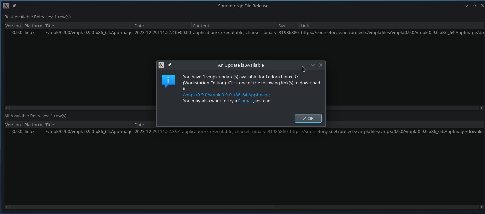

# SFUpdateChecker

Update Checker for releases published on Sourceforge.

## Why?

Sourceforge is my hosting of choice for publishing releases, because ...

* There are many mirrors that ensure high speed downloads to users anywhere in the world.
* Offers detailed download statistics for every file, segmented by geography, operating system, and time.
* Last but not least, it offers XML and JSON data to retrieve the latest available releases that make it possible this update checker without needing to manually publish the data for every release.

## How?

Every project on Sourceforge has the following two web endpoints:

* RSS (XML) feeds: https://sourceforge.net/projects/project_name/rss
* JSON Latest Release: https://sourceforge.net/projects/project_name/best_release.json

It is possible to retrieve automatically these documents, and compare the latest releases with the current release that the user is running. The documents also contain URLs to download the files.

## Details

The file release information is stored in the `ReleaseData` struct and the collection `ReleasesList`, which is defined in the header "releasedata.h".

There are two classes (collections) of file releases:

* `BestReleases` (which exploits the JSON file) in "bestreleases.h"
* `ReleaseTable` (which exploits the RSS feed) in "releasestable.h"

You don't need to use both classes. The headers and implementations reside in the `library` directory. Their methods are similar:

 | Function | Returned Type | Function Description  |
 | -------- | ------------- | --------------------- |
 | `parseFromFile()` | void | for testing with a local file, for testing purposes |
 | `getFromSourceforge()` | void | gets the data from Sourceforge |
 | `filtered()` | ReleasesList | new available releases filtered by operating system, version, and date |
 | `filteredCount()` | int | number of new releases available |
 | `currentRelease()` | const ReleaseData | synthesized current release data |
 | `currentProject()` | const QString | current project name |

The current project release is defined in the library/CMakeLists.txt with a few variables. For instance:

```
set(PR_VERSION "0.9.0")
set(PR_PROJECT "vmpk")
set(PR_DATETIME "2023-12-29T00:59:59Z")
```

There is a demo program in the root directory showing as example the latest releases available for the [VMPK](https://github.com/pedrolcl/VMPK) project.

This is a work in progress.



## License

Copyright (c) 2024, Pedro López-Cabanillas  

SPDX-License-Identifier: GPL-3.0-or-later  
